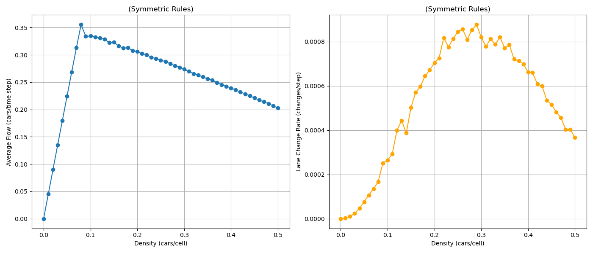
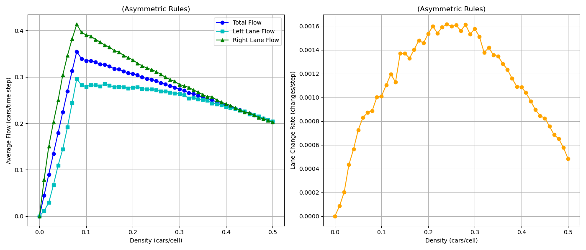
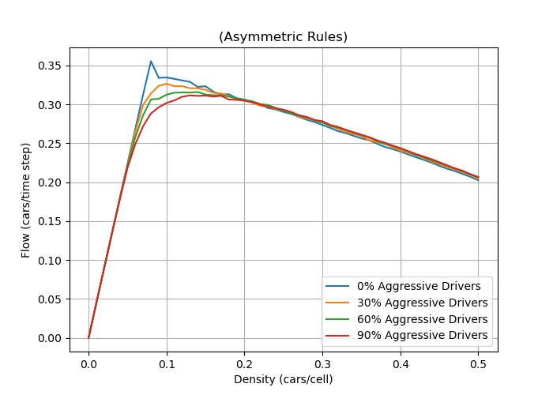

# Two-Lane Highway Traffic Flow — Cellular Automaton

A discrete cellular-automaton (CA) simulation of a two-lane highway, built for
the **IMS** (Modelování a simulace / Modelling and Simulation) course at VUT FIT
Brno. The model reproduces the results of Rickert et al. [[1]](#references)
and extends them to study how aggressive drivers affect traffic flow.

## Motivation

The goal is to reproduce the two-lane CA model from [[1]](#references) and then
extend it to examine how different driver archetypes — specifically aggressive
ones — affect flow on a highway segment. The working hypothesis was that
aggressive driving worsens conditions for everyone else. The experiments
disprove that hypothesis in the congested regime: see [Experiment 3](#experiment-3).

## Model

The simulation is based on the **Nagel–Schreckenberg (NaSch)** single-lane CA
[[2]](#references), extended with lane-change rules from [[1]](#references).

The road is a 1-D array of cells; one cell = `7.5 m` and can hold at most one
vehicle. The system is a closed ring (periodic boundary). Each simulation step
represents `1 s` of real time, so moving one cell/step ≈ `7.5 m/s` (`27 km/h`).
`VMAX = 5` cells/step corresponds to `135 km/h`.

### Single-lane update (NaSch)

For every vehicle, each step applies four sub-steps in order:

| Step          | Rule                                                         |
|---------------|--------------------------------------------------------------|
| Acceleration  | `v_i = min(v_i + 1, v_max)`                                  |
| Deceleration  | `v_i = min(v_i, gap(i))`                                     |
| Randomization | `v_i = max(v_i - 1, 0)` with probability `b`, else unchanged |
| Movement      | `x_i = x_i + v_i`                                            |

where `gap(i)` is the number of empty cells ahead of vehicle *i*. The
randomization step models driver dawdling.

### Lane-change rules

A vehicle *i* may change lanes if **all three** hold:

| Condition   | Rule                           | Meaning                               |
|-------------|--------------------------------|---------------------------------------|
| Incentive   | `gap(i) < l`                   | current lane is slowing it down       |
| Improvement | `gap_o(i) > l_o`               | the other lane offers more room ahead |
| Safety      | `gap_{o,back}(i) > l_{o,back}` | enough room behind in the target lane |

If all three are satisfied, the change happens with probability `c`.

**Symmetric rules** — both lanes use the same incentive (front gap too small).

**Asymmetric rules** — the right lane changes only when blocked; the left lane
may always change back. This models "keep right except to overtake"

### Aggressive drivers

Aggressive drivers have `l_{o,back} = 0` — they ignore the back-gap safety
check when changing lanes. Non-aggressive drivers keep `l_{o,back} = 5`. The
model is collision-free, so an aggressive lane change only forces the car behind
to slow down. The implementation supports a heterogeneous mix: any fraction of
the fleet can be aggressive.

---

## Implementation

C++ was chosen for speed and memory control. The simulation core is written from
scratch; movement logic follows NaSch [[2]](#references), and the symmetric /
asymmetric lane-change rules follow [[1]](#references).

### Architecture

| Class        | Role                                                                                                                                  |
|--------------|---------------------------------------------------------------------------------------------------------------------------------------|
| `Car`        | A vehicle: id, lane, position, velocity, `aggressive` flag. Provides `front_gap()` and `back_gap()`.                                  |
| `Lane`       | One lane as a vector of cells (`occ` for time *t*, `next_occ` for *t+1*). `-1` = empty. Double-buffering enables the parallel update. |
| `Simulation` | Owns lanes and cars. `spawn_cars(density, aggressive_ratio)` seeds the road; `step()` runs one tick; `reset()` clears state.          |
| `Statistics` | Collects per-step density, flow, lane-change rate, per-lane flow; can dump a full space–time CSV.                                     |

All tunable constants live in `include/config.h`:

```cpp
constexpr double CELL_SIZE_M      = 7.5;   // one cell = 7.5 m
constexpr int    MAIN_LANE_LENGTH = 1200;  // ring length in cells (~9 km)
constexpr int    VMAX             = 5;     // cells / step (~135 km/h)
constexpr int    DELTA            = 1;     // 1 s of model time per step
constexpr double BREAKING_PROB    = 0.5;   // dawdle probability b
constexpr double LANE_CHANGE_PROB = 1.0;   // lane-change probability c
constexpr int    MAX_TIME_STEP    = 5000;
constexpr int    WARMUP_STEPS     = 1000;
```

### Step pseudocode

```
FOR every car
  evaluate incentive, improvement, safety, target-cell free
  IF (incentive AND improvement AND safety AND free) THEN
    with probability c, plan a lane change
  END IF
ENDFOR

apply all planned lane changes          // parallel: uses t+1 buffer

FOR every car
  plan velocity and position update     // NaSch 4 sub-steps
ENDFOR

apply all planned velocity/position updates   // parallel
```

### Warmup

Vehicles are placed randomly at `v = 0`. The simulation first runs a warmup
phase (default `1000` steps, no stats collected) to reach a stationary state,
then runs the measured phase (default `5000` steps).

---

## Build & run

Requires a C++20 compiler (`g++ ≥ 11` or `clang++ ≥ 14`).

```bash
make -j          # build → ./ca
make debug       # -g -DDEBUG_PRINT -Wconversion -Wall -Wextra -Werror
make clean
```

```bash
./ca [options]
```

| Flag           | Meaning                                       | Default |
|----------------|-----------------------------------------------|---------|
| `-d <density>` | Traffic density (0 – 1.0)                     | `0.1`   |
| `-a <ratio>`   | Fraction of aggressive drivers (0 – 1.0)      | `0.0`   |
| `-w <steps>`   | Warmup steps (not measured)                   | `1000`  |
| `-s <steps>`   | Measured simulation steps                     | `5000`  |
| `-y`           | Asymmetric lane-change rules (keep-right)     | off     |
| `-p`           | Print CSV summary row + dump `space_time.csv` | off     |
| `-h`           | Help                                          |         |

With `-p`, stdout gets `density,aggressive,flow,lane_change_rate,left_flow,right_flow`
and `space_time.csv` is written with `time,lane,position,car_id` for diagramming.

---

## Repository layout

```
.
├── include/             Headers: config.h, Car.h, Lane.h, Simulation.h, Statistics.h
├── src/                 Implementation
├── scripts/
│   ├── runner.sh        Sweep density × aggressiveness → CSVs → plots
│   ├── graphs.py        Fundamental-diagram + per-lane + aggressiveness plots
│   └── spacetime.py     Space–time diagram from space_time.csv
├── Makefile             all / run / debug / clean / zip
├── compile_flags.txt    clangd hints (-std=c++20)
├── requirements.txt     pandas, matplotlib
└── IMS.pdf              Full project report (Czech)
```

---

## Experiments

All experiments: `9 km` highway, `5000` measured steps, `1000` warmup steps,
`v_max = 5`, `b = 0.5`, `c = 1`.

### Experiment 1 — symmetric rules (validation)

Parameters: `l = v_i + 1`, `l_o = l`, `l_{o,back} = 5`, no aggressive drivers,
symmetric rules. Results reproduce [[1]](#references) (Fig 3, Fig 5): peak flow
at density ≈ `0.08`; traffic splits evenly across both lanes.

**Left:** Flow vs. density. **Right:** Lane-change rate vs. density.



### Experiment 2 — asymmetric rules

Same parameters as Exp. 1 but with asymmetric rules. Lane-change rate ≈ `2×`
higher than symmetric. Right-lane flow dominates the left lane, confirming that
drivers stay right and use the left lane only for overtaking — visible in the
space–time diagram as a sparser left lane.

**Left:** Flow vs. density (total + per lane). **Right:** Lane-change rate vs. density.



### Experiment 3 — aggressive drivers

Asymmetric rules, `l = v_i + 1`, `l_o = l`; passive drivers `l_{o,back} = 5`,
aggressive drivers `l_{o,back} = 0` (they ignore the car behind when changing).
Sweep over `0%, 30%, 60%, 90%` aggressive.

- Near the critical density (`≈ 0.08`), aggressive drivers **reduce** overall
  flow — they cause stop-and-go waves by cutting in too close.
- At higher density (`ρ > 0.2`), aggressive drivers **increase** flow: passive
  drivers get stuck behind slower traffic waiting for a gap that never opens,
  while aggressive ones exploit small gaps and spread vehicles across both lanes.



This contradicts the original hypothesis. Aggressive driving is harmful at
critical density but can be beneficial in the congested regime.

### Reproducing

```bash
python3 -m venv .venv && source .venv/bin/activate
pip install -r requirements.txt

./scripts/runner.sh                 # builds, sweeps, produces results/*.png
python3 scripts/spacetime.py       # from a run that wrote space_time.csv
```

`runner.sh` sweeps density `0 → 0.5` for several aggressiveness levels and
calls `graphs.py` to generate the fundamental diagrams.

---

## References

1. M. Rickert, K. Nagel, M. Schreckenberg, A. Latour. *Two lane traffic
   simulations using cellular automata.* Physica A **231**(4), 534–550 (1996).
   doi:10.1016/0378-4371(95)00442-4
2. K. Nagel, M. Schreckenberg. *A cellular automaton model for freeway traffic.*
   J. Phys. I **2**(12), 2221–2229 (1992). doi:10.1051/jp1:1992277